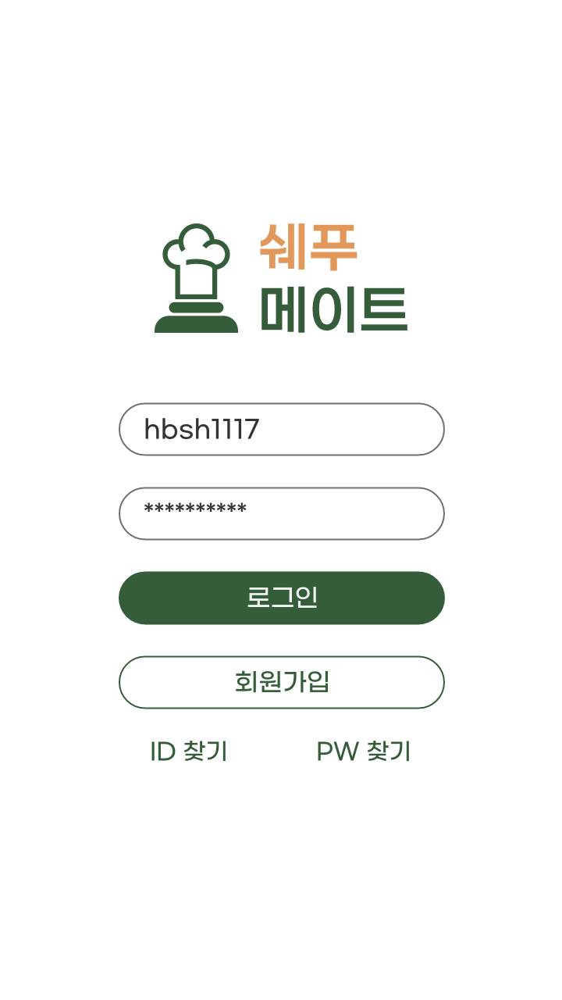
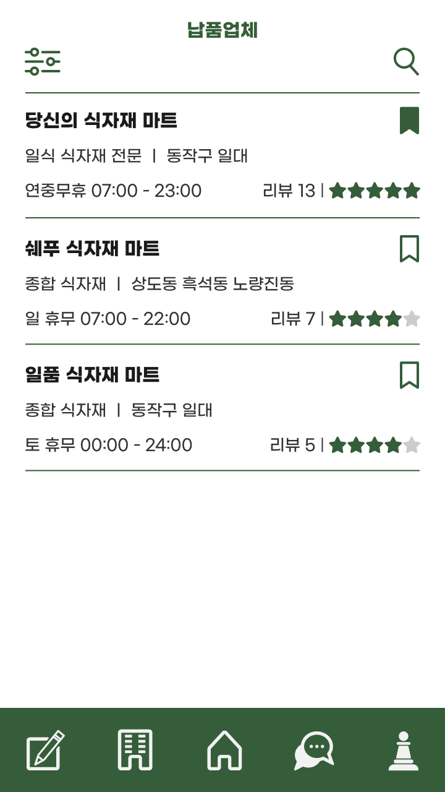
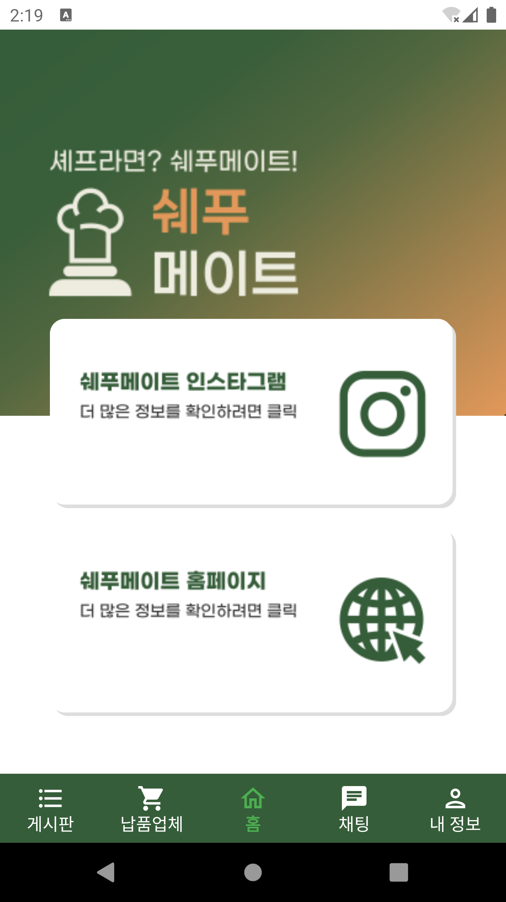
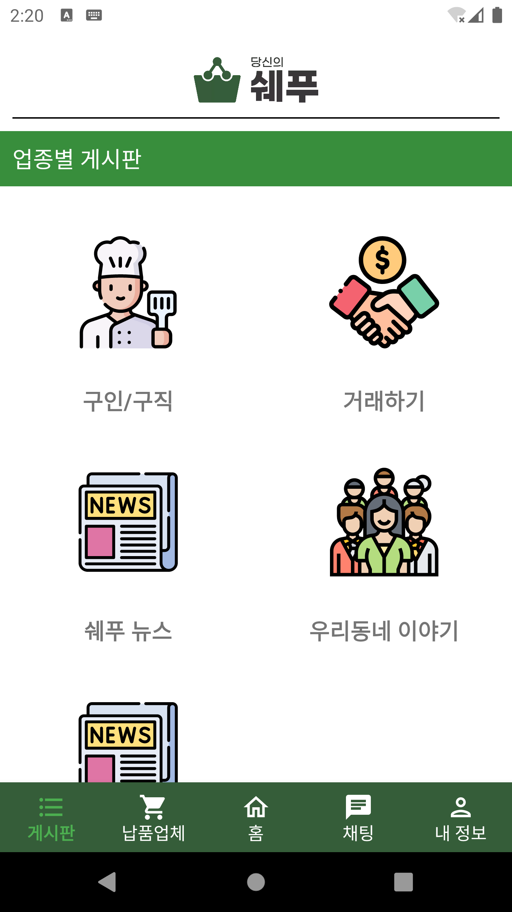
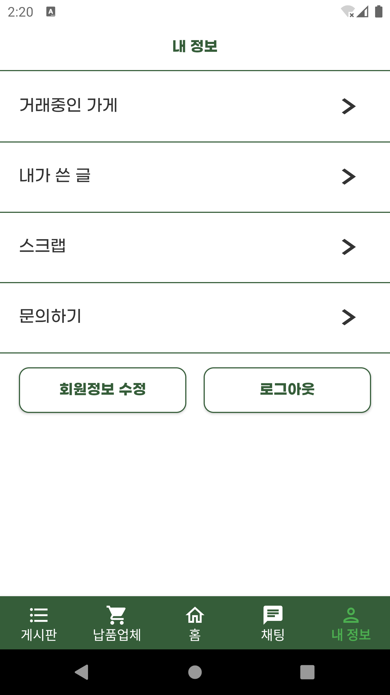
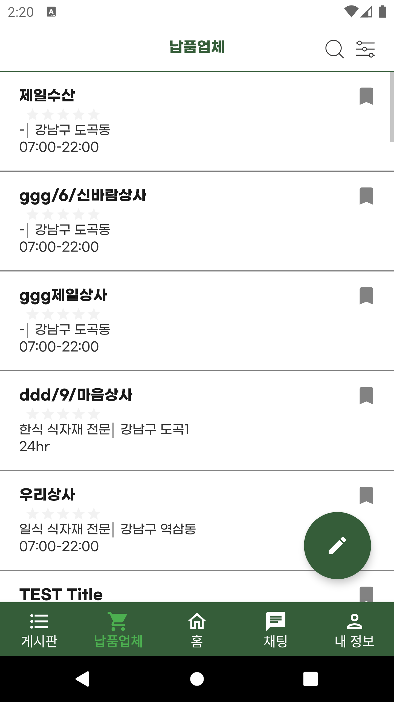
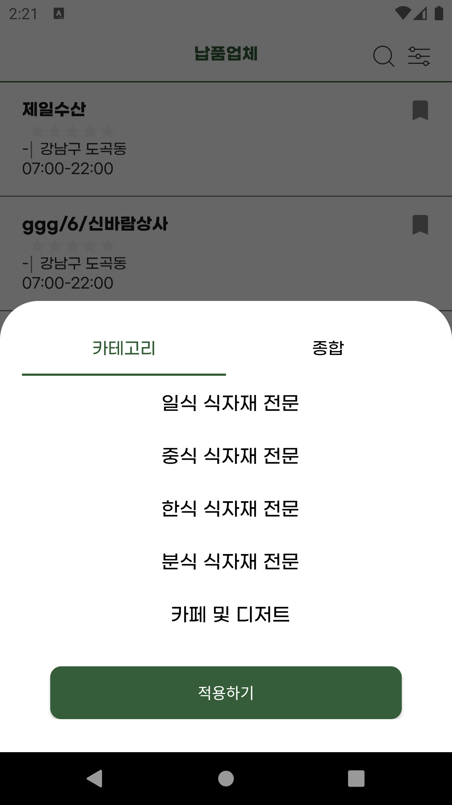
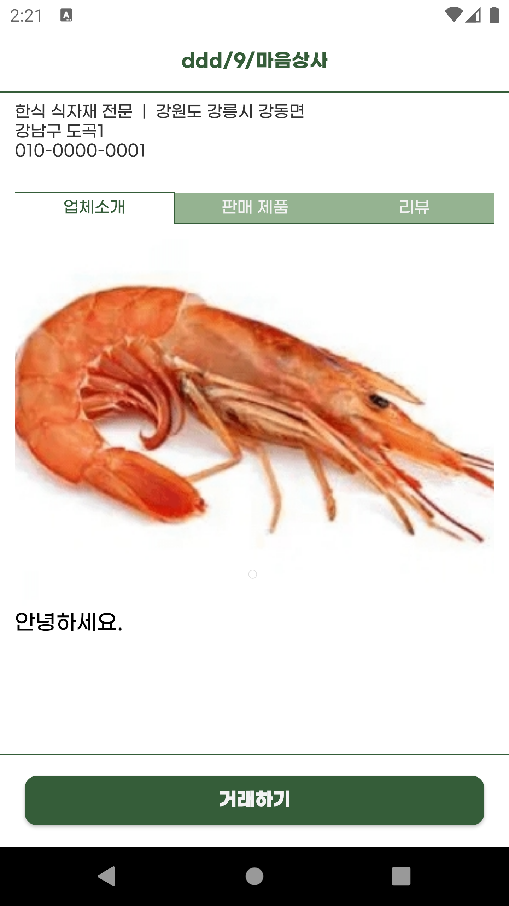
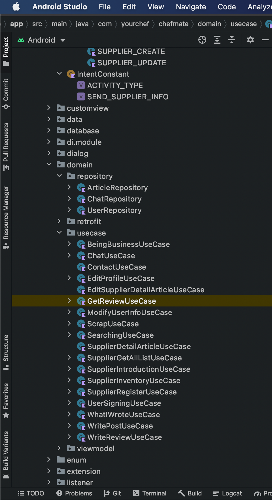
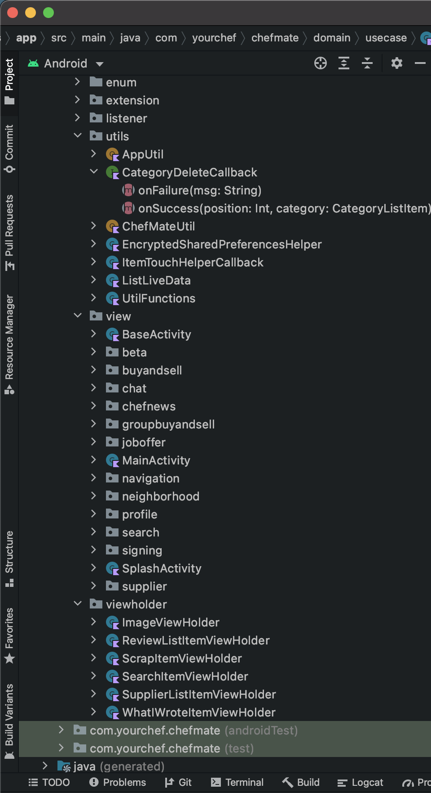

# 당신의 쉐푸 (안드로이드 사이드프로젝트)

  

  

  

 

    당신의 쉐푸는 소상공인들끼리 남는 식자재를 공유 또는 거래하는 플랫폼 입니다.
    대학생과 직장인 등으로 구성되었고, 어플리케이션 베타버전 개발까지 3명의 안드로이드 개발자와 1명의 서버개발자 그리고 1명의 UI/UX 디자이너가 참여하였습니다.
    2021 창업 300에서 우수 창업팀으로 선정되었고, 중앙대학교 창업 지원팀 등에서 투자를 받고 현재 사업자 등록까지 마친 상태입니다.

## 개발 환경
    Kotlin

## 아키텍쳐
    Model - Repository - Usecase - ViewModel - View 의 CleanArchitecture 구성
    Koin di, Coroutine, AAC
   

   
   

## 맡은 부분
    회원가입, 로그인, 납품업체 소개, 내정보 확인 및 변경 등을 작업했습니다. 
